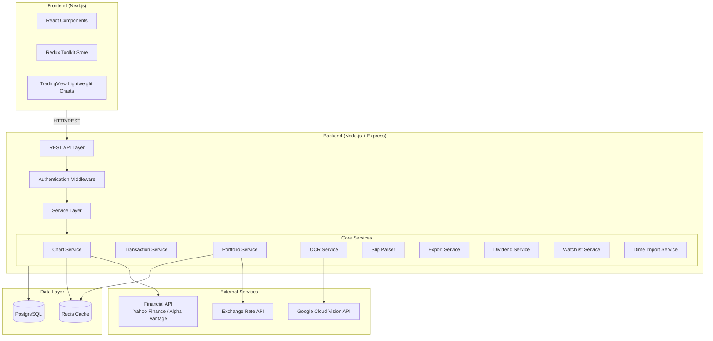
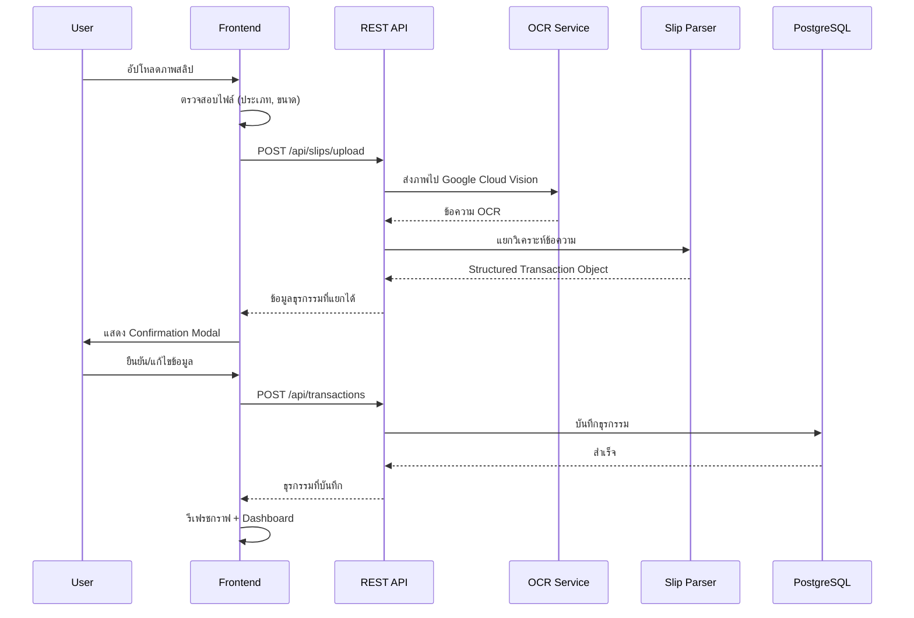
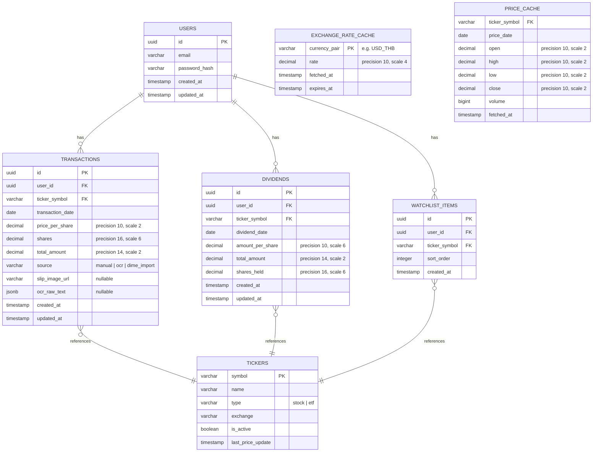

# เอกสารการออกแบบ (Design Document)

## ภาพรวม (Overview)

ระบบ Stock Portfolio Tracker เป็นแอปพลิเคชันเว็บสำหรับนักลงทุนไทยที่ลงทุนในหุ้นและ ETF ของสหรัฐอเมริกา ระบบนี้ช่วยแก้ปัญหาหลักคือการติดตามจุดซื้อ (Buy Point) บนกราฟราคาหุ้น โดยรองรับการอ่านสลิปซื้อจากแอป Dime ผ่าน OCR อัตโนมัติ และแสดงผลเป็นกราฟ Interactive พร้อม Buy Point Markers

### เป้าหมายหลัก
- แสดงกราฟราคาหุ้น/ETF แบบ Interactive พร้อม Buy Point Markers
- อ่านสลิปซื้อจาก Dime ผ่าน OCR และแยกวิเคราะห์ข้อมูลธุรกรรมอัตโนมัติ
- แสดงภาพรวมพอร์ตการลงทุนพร้อมกำไร/ขาดทุน ทั้ง USD และ THB
- รองรับการจัดการธุรกรรมด้วยตนเอง, ส่งออกข้อมูล, ติดตามเงินปันผล, และ Watchlist

### การตัดสินใจทางเทคนิค
- **Frontend**: Next.js 14 (App Router) + React + TypeScript + Tailwind CSS + Redux Toolkit
- **Charts**: TradingView Lightweight Charts (เหมาะกับกราฟการเงินมากกว่า Recharts เพราะรองรับ Candlestick, Zoom/Pan, และ Markers ในตัว)
- **Backend**: Node.js + Express.js RESTful API (เลือก REST แทน GraphQL เพราะ API มีโครงสร้างชัดเจนและไม่ซับซ้อนเกินไป)
- **OCR**: Google Cloud Vision API (ความแม่นยำสูงกว่า Tesseract.js สำหรับข้อความภาษาอังกฤษบนสลิป Dime)
- **Database**: PostgreSQL (เหมาะกับข้อมูลธุรกรรมที่มีโครงสร้างชัดเจนและต้องการ ACID compliance)
- **Containerization**: Docker + Docker Compose

## สถาปัตยกรรม (Architecture)

### สถาปัตยกรรมระดับสูง (High-Level Architecture)



### สถาปัตยกรรมระดับต่ำ (Low-Level Architecture)

ระบบใช้สถาปัตยกรรมแบบ Layered Architecture:

1. **Presentation Layer** (Next.js): จัดการ UI, routing, state management
2. **API Layer** (Express.js): จัดการ HTTP requests, validation, authentication
3. **Service Layer**: Business logic ทั้งหมด
4. **Data Access Layer**: Repository pattern สำหรับเข้าถึงฐานข้อมูล
5. **External Integration Layer**: เชื่อมต่อ Financial API, OCR, Exchange Rate

### Flow การอัปโหลดสลิปและ OCR




## คอมโพเนนต์และอินเทอร์เฟซ (Components and Interfaces)

### Frontend Components

#### 1. Chart Components
- **StockChart**: คอมโพเนนต์หลักสำหรับแสดงกราฟราคาหุ้น ใช้ TradingView Lightweight Charts
  - Props: `ticker: string`, `timeRange: TimeRange`, `buyPoints: BuyPoint[]`
  - รองรับ Candlestick chart พร้อม OHLC data
  - แสดง Buy Point Markers และเส้น Average Cost Basis
- **BuyPointMarker**: คอมโพเนนต์สำหรับแสดงจุดซื้อบนกราฟ
  - แสดง Tooltip เมื่อ hover (วันที่, จำนวนหุ้น, ราคา, จำนวนเงิน)
  - คลิกเพื่อแสดงรายละเอียดในแผงด้านข้าง
- **TimeRangeSelector**: ตัวเลือกช่วงเวลา (1W, 1M, 3M, 6M, 1Y, All)
- **TickerSearch**: ช่องค้นหา Ticker Symbol พร้อม autocomplete

#### 2. Transaction Components
- **SlipUploader**: คอมโพเนนต์อัปโหลดสลิป (รองรับ drag & drop, multi-file)
  - ตรวจสอบประเภทไฟล์ (JPG/PNG) และขนาด (≤10MB)
  - แสดง Progress Bar สำหรับ batch upload
- **ConfirmationModal**: หน้าต่างยืนยันข้อมูลธุรกรรมจาก OCR
  - แสดงข้อมูลที่แยกได้พร้อมเน้นฟิลด์ที่ต้องกรอกเพิ่ม
  - รองรับการแก้ไขก่อนบันทึก
- **TransactionForm**: ฟอร์มเพิ่ม/แก้ไขธุรกรรมด้วยตนเอง
- **TransactionTable**: ตารางแสดงประวัติธุรกรรม พร้อมกรอง/เรียงลำดับ

#### 3. Portfolio Components
- **PortfolioDashboard**: หน้าแสดงภาพรวมพอร์ต
  - มูลค่ารวม (USD/THB), Unrealized P/L, Total Return
  - Asset Allocation pie chart (ใช้ Recharts สำหรับ pie chart)
- **CurrencyToggle**: สลับการแสดงผลระหว่าง USD และ THB
- **BenchmarkComparison**: กราฟเปรียบเทียบผลตอบแทนกับ S&P 500

#### 4. Dividend Components
- **DividendForm**: ฟอร์มบันทึกเงินปันผล
- **DividendTable**: ตารางประวัติเงินปันผล พร้อมกรอง/เรียงลำดับ

#### 5. Watchlist Components
- **WatchlistPanel**: แสดงรายการหุ้นที่ติดตาม พร้อม Sparkline
- **WatchlistItem**: แสดงข้อมูลหุ้นแต่ละตัว (ราคา, % เปลี่ยนแปลง)

#### 6. Export & Import Components
- **ExportDialog**: หน้าต่างเลือกรูปแบบและเงื่อนไขการส่งออก
- **DimeImportDialog**: หน้าต่างนำเข้าข้อมูลจาก Dime

### Backend API Endpoints

```
# Chart & Price Data
GET    /api/stocks/:ticker/prices?range={timeRange}
GET    /api/stocks/:ticker/info
GET    /api/stocks/search?q={query}

# Transactions
GET    /api/transactions?ticker={ticker}&from={date}&to={date}&sort={field}&order={asc|desc}
POST   /api/transactions
PUT    /api/transactions/:id
DELETE /api/transactions/:id

# Slip Upload & OCR
POST   /api/slips/upload          (single slip)
POST   /api/slips/upload-batch    (multi-slip, up to 20)

# Portfolio
GET    /api/portfolio/summary
GET    /api/portfolio/allocation
GET    /api/portfolio/performance?range={timeRange}&benchmark={index}

# Dividends
GET    /api/dividends?ticker={ticker}&from={date}&to={date}
POST   /api/dividends
PUT    /api/dividends/:id
DELETE /api/dividends/:id
GET    /api/dividends/summary?range={timeRange}

# Watchlist
GET    /api/watchlist
POST   /api/watchlist
DELETE /api/watchlist/:ticker

# Export
GET    /api/export/transactions?format={csv|xlsx}&ticker={ticker}&from={date}&to={date}

# Import
POST   /api/import/dime           (CSV/JSON file upload)

# Exchange Rate
GET    /api/exchange-rate/usd-thb

# Ticker Validation
GET    /api/tickers/validate/:ticker
```

### Service Layer Interfaces

```typescript
// Chart Service
interface IChartService {
  getStockPrices(ticker: string, range: TimeRange): Promise<OHLCData[]>;
  getStockInfo(ticker: string): Promise<StockInfo>;
  searchTickers(query: string): Promise<TickerSearchResult[]>;
}

// Transaction Service
interface ITransactionService {
  getTransactions(filters: TransactionFilters): Promise<PaginatedResult<Transaction>>;
  createTransaction(data: CreateTransactionDTO): Promise<Transaction>;
  updateTransaction(id: string, data: UpdateTransactionDTO): Promise<Transaction>;
  deleteTransaction(id: string): Promise<void>;
  getBuyPointsForTicker(ticker: string): Promise<BuyPoint[]>;
}

// OCR Service
interface IOCRService {
  extractText(imageBuffer: Buffer): Promise<OCRResult>;
}

// Slip Parser
interface ISlipParser {
  parse(ocrText: string): ParseResult;
  toStructuredTransaction(parseResult: ParseResult): StructuredTransaction;
  serializeTransaction(txn: StructuredTransaction): string;
  deserializeTransaction(json: string): StructuredTransaction;
}

// Portfolio Service
interface IPortfolioService {
  getSummary(): Promise<PortfolioSummary>;
  getAllocation(): Promise<AssetAllocation[]>;
  getPerformance(range: TimeRange, benchmark: string): Promise<PerformanceData>;
  calculateUnrealizedPL(holdings: Holding[], currentPrices: Map<string, number>): UnrealizedPL[];
  calculateAverageCostBasis(transactions: Transaction[]): number;
}

// Export Service
interface IExportService {
  exportToCSV(filters: ExportFilters): Promise<Buffer>;
  exportToExcel(filters: ExportFilters): Promise<Buffer>;
  importFromCSV(csvBuffer: Buffer): Promise<Transaction[]>;
}

// Dividend Service
interface IDividendService {
  getDividends(filters: DividendFilters): Promise<PaginatedResult<Dividend>>;
  createDividend(data: CreateDividendDTO): Promise<Dividend>;
  updateDividend(id: string, data: UpdateDividendDTO): Promise<Dividend>;
  deleteDividend(id: string): Promise<void>;
  getDividendSummary(range: TimeRange): Promise<DividendSummary>;
  calculateDividendYield(holdings: Holding[], dividends: Dividend[]): number;
}

// Watchlist Service
interface IWatchlistService {
  getWatchlist(): Promise<WatchlistItem[]>;
  addToWatchlist(ticker: string): Promise<WatchlistItem>;
  removeFromWatchlist(ticker: string): Promise<void>;
}

// Dime Import Service
interface IDimeImportService {
  parseFile(fileBuffer: Buffer, format: 'csv' | 'json'): Promise<ImportParseResult>;
  detectDuplicates(transactions: StructuredTransaction[]): Promise<DuplicateCheckResult>;
  importTransactions(transactions: StructuredTransaction[], overwriteDuplicates: boolean): Promise<ImportResult>;
}

// Exchange Rate Service
interface IExchangeRateService {
  getCurrentRate(): Promise<ExchangeRate>;
  convertUSDToTHB(amountUSD: number): Promise<number>;
}
```


## แบบจำลองข้อมูล (Data Models)

### ER Diagram



### TypeScript Type Definitions

```typescript
// Core Types
type TimeRange = '1W' | '1M' | '3M' | '6M' | '1Y' | 'ALL';
type TransactionSource = 'manual' | 'ocr' | 'dime_import';
type ExportFormat = 'csv' | 'xlsx';

// Transaction
interface Transaction {
  id: string;
  userId: string;
  tickerSymbol: string;
  transactionDate: string; // ISO 8601 (YYYY-MM-DD)
  pricePerShare: number;
  shares: number;
  totalAmount: number;
  source: TransactionSource;
  slipImageUrl?: string;
  ocrRawText?: string;
  createdAt: string;
  updatedAt: string;
}

// Structured Transaction (จาก Slip Parser)
interface StructuredTransaction {
  ticker: string;
  date: string; // ISO 8601 (YYYY-MM-DD)
  price_per_share: number;
  shares: number;
  total_amount: number;
}

// Buy Point (สำหรับแสดงบนกราฟ)
interface BuyPoint {
  date: string;
  pricePerShare: number;
  shares: number;
  totalAmount: number;
  transactionCount: number; // จำนวนธุรกรรมในวันเดียวกัน
}

// OHLC Data
interface OHLCData {
  time: string; // ISO 8601
  open: number;
  high: number;
  low: number;
  close: number;
  volume: number;
}

// Portfolio Summary
interface PortfolioSummary {
  totalValueUSD: number;
  totalValueTHB: number;
  totalCostBasis: number;
  unrealizedPLUSD: number;
  unrealizedPLTHB: number;
  unrealizedPLPercent: number;
  totalDividendsReceived: number;
  totalReturnUSD: number;
  totalReturnPercent: number;
  dividendYieldPercent: number;
  exchangeRate: ExchangeRate;
  holdings: Holding[];
}

// Holding
interface Holding {
  tickerSymbol: string;
  tickerName: string;
  totalShares: number;
  averageCostBasis: number;
  currentPrice: number;
  currentValueUSD: number;
  unrealizedPLUSD: number;
  unrealizedPLPercent: number;
  allocationPercent: number;
  totalDividends: number;
  totalReturnUSD: number;
  totalReturnPercent: number;
}

// Asset Allocation
interface AssetAllocation {
  tickerSymbol: string;
  tickerName: string;
  valueUSD: number;
  percentage: number;
}

// Dividend
interface Dividend {
  id: string;
  userId: string;
  tickerSymbol: string;
  dividendDate: string;
  amountPerShare: number;
  totalAmount: number;
  sharesHeld: number;
  createdAt: string;
  updatedAt: string;
}

// Watchlist Item
interface WatchlistItem {
  tickerSymbol: string;
  tickerName: string;
  currentPrice: number;
  priceChangeAmount: number;
  priceChangePercent: number;
  sparklineData: number[]; // ราคาปิด 7 วันล่าสุด
}

// Exchange Rate
interface ExchangeRate {
  currencyPair: string;
  rate: number;
  fetchedAt: string;
  isStale: boolean; // true ถ้าเป็นข้อมูลจาก cache เก่า
}

// OCR Result
interface OCRResult {
  text: string;
  confidence: number;
  success: boolean;
  error?: string;
}

// Parse Result
interface ParseResult {
  ticker?: string;
  date?: string;
  pricePerShare?: number;
  shares?: number;
  totalAmount?: number;
  missingFields: string[];
  confidence: Record<string, number>;
}

// Export Filters
interface ExportFilters {
  format: ExportFormat;
  tickerSymbol?: string;
  fromDate?: string;
  toDate?: string;
}

// Import Parse Result
interface ImportParseResult {
  transactions: StructuredTransaction[];
  errors: ImportError[];
  totalRows: number;
  successfulRows: number;
}

// Duplicate Check Result
interface DuplicateCheckResult {
  duplicates: Array<{
    imported: StructuredTransaction;
    existing: Transaction;
  }>;
  unique: StructuredTransaction[];
}

// Filters
interface TransactionFilters {
  tickerSymbol?: string;
  fromDate?: string;
  toDate?: string;
  sortBy?: 'date' | 'ticker' | 'amount';
  sortOrder?: 'asc' | 'desc';
  page?: number;
  pageSize?: number;
}

interface DividendFilters {
  tickerSymbol?: string;
  fromDate?: string;
  toDate?: string;
  page?: number;
  pageSize?: number;
}
```

### Caching Strategy

- **Price Data**: แคชใน Redis ด้วย TTL 5 นาทีสำหรับข้อมูลราคาล่าสุด, 24 ชั่วโมงสำหรับข้อมูลย้อนหลัง
- **Exchange Rate**: แคชใน Redis ด้วย TTL 30 นาที, fallback เป็นค่าล่าสุดใน PostgreSQL ถ้า API ล่ม
- **Portfolio Summary**: แคชใน Redis ด้วย TTL 1 นาที, invalidate เมื่อมีธุรกรรมใหม่
- **Ticker Search**: แคชผลลัพธ์การค้นหาใน Redis ด้วย TTL 1 ชั่วโมง


## คุณสมบัติความถูกต้อง (Correctness Properties)

*คุณสมบัติ (Property) คือลักษณะหรือพฤติกรรมที่ควรเป็นจริงในทุกการทำงานที่ถูกต้องของระบบ เป็นข้อกำหนดเชิงรูปนัยเกี่ยวกับสิ่งที่ระบบควรทำ Properties ทำหน้าที่เป็นสะพานเชื่อมระหว่างข้อกำหนดที่มนุษย์อ่านได้กับการรับประกันความถูกต้องที่เครื่องตรวจสอบได้*

### Property 1: StructuredTransaction JSON Round-trip

*สำหรับทุก* StructuredTransaction object ที่ถูกต้อง การ serialize เป็น JSON แล้ว deserialize กลับ จะต้องได้ object ที่เทียบเท่ากับต้นฉบับ (ticker, date, price_per_share, shares, total_amount ต้องเท่ากันทุกค่า)

**Validates: Requirements 4.5**

### Property 2: Slip Parser แยกวิเคราะห์ข้อมูลจาก OCR Text ได้ถูกต้อง

*สำหรับทุก* ข้อความ OCR ที่มีรูปแบบถูกต้องของสลิป Dime ซึ่งประกอบด้วย Ticker Symbol ที่อยู่ในรายชื่อที่รองรับ, วันที่ในรูปแบบต่างๆ, ราคาต่อหุ้น, และจำนวนหุ้น — Slip Parser จะต้อง:
- แยก Ticker Symbol ได้ตรงกับค่าที่ฝังอยู่ในข้อความ
- แปลงวันที่เป็นรูปแบบ ISO 8601 (YYYY-MM-DD) ได้ถูกต้อง
- แยกค่าราคาเป็นทศนิยม 2 ตำแหน่ง และจำนวนหุ้นเป็นทศนิยม 6 ตำแหน่ง
- สร้าง Structured Transaction Object ที่มีฟิลด์ครบถ้วน (ticker, date, price_per_share, shares, total_amount)
- ระบุฟิลด์ที่ขาดหายไปได้ถูกต้องเมื่อข้อมูลไม่ครบ

**Validates: Requirements 3.3, 3.7, 4.1, 4.2, 4.3, 4.4**

### Property 3: การคำนวณต้นทุนเฉลี่ยต่อหุ้น (Average Cost Basis)

*สำหรับทุก* ชุดธุรกรรมซื้อของหุ้นตัวเดียวกัน ต้นทุนเฉลี่ยต่อหุ้นจะต้องเท่ากับ ผลรวมจำนวนเงินลงทุนทั้งหมด หารด้วย ผลรวมจำนวนหุ้นทั้งหมด (sum(total_amount) / sum(shares))

**Validates: Requirements 2.4, 5.2**

### Property 4: การรวม Buy Point Markers ในวันเดียวกัน

*สำหรับทุก* ชุดธุรกรรมซื้อที่มีบางรายการอยู่ในวันเดียวกัน การรวม Buy Point Markers จะต้องได้จำนวน markers เท่ากับจำนวนวันที่ไม่ซ้ำกัน และแต่ละ marker ต้องมี transactionCount เท่ากับจำนวนธุรกรรมในวันนั้น

**Validates: Requirements 2.5**

### Property 5: การคำนวณมูลค่าพอร์ตและ Unrealized P/L

*สำหรับทุก* ชุดหุ้นที่ถือครองพร้อมราคาปัจจุบัน:
- มูลค่ารวมพอร์ต = sum(shares × currentPrice) สำหรับทุกหุ้น
- Unrealized P/L ของแต่ละหุ้น = (currentPrice - averageCostBasis) × shares
- Unrealized P/L รวม = sum(Unrealized P/L ของแต่ละหุ้น)
- Unrealized P/L เป็นเปอร์เซ็นต์ = (Unrealized P/L รวม / ต้นทุนรวม) × 100

**Validates: Requirements 5.1, 5.3**

### Property 6: สัดส่วนการจัดสรรสินทรัพย์รวมเป็น 100%

*สำหรับทุก* ชุดหุ้นที่ถือครองที่มีมูลค่ารวมมากกว่า 0 ผลรวมของเปอร์เซ็นต์การจัดสรรสินทรัพย์ของทุกหุ้นจะต้องเท่ากับ 100% (ยอมรับความคลาดเคลื่อนจากการปัดเศษ ±0.01%)

**Validates: Requirements 5.4**

### Property 7: การตรวจสอบความถูกต้องของข้อมูลธุรกรรม

*สำหรับทุก* ข้อมูลธุรกรรมที่ส่งเข้ามา:
- ธุรกรรมที่มี Ticker Symbol ไม่ตรงกับหุ้นที่มีอยู่จริง จะต้องถูกปฏิเสธ
- ธุรกรรมที่มีวันที่เป็นอนาคต จะต้องถูกปฏิเสธ
- ธุรกรรมที่มีราคาหรือจำนวนหุ้นเป็นค่าลบหรือศูนย์ จะต้องถูกปฏิเสธ
- ธุรกรรมที่ผ่านเงื่อนไขทั้งหมดข้างต้น จะต้องถูกยอมรับ

**Validates: Requirements 6.2**

### Property 8: การกรองข้อมูลธุรกรรมและเงินปันผล

*สำหรับทุก* ชุดข้อมูล (ธุรกรรมหรือเงินปันผล) และเงื่อนไขการกรอง (Ticker Symbol และ/หรือช่วงวันที่) ผลลัพธ์ที่ได้จะต้องประกอบด้วยเฉพาะรายการที่ตรงกับเงื่อนไขทั้งหมดที่ระบุ และจะต้องไม่มีรายการใดที่ไม่ตรงกับเงื่อนไขรวมอยู่ในผลลัพธ์

**Validates: Requirements 6.5, 8.3, 8.4, 11.4**

### Property 9: การเรียงลำดับข้อมูล

*สำหรับทุก* ชุดข้อมูล (ธุรกรรม, เงินปันผล, หรือ Watchlist) และเงื่อนไขการเรียงลำดับ ผลลัพธ์ที่ได้จะต้องเรียงลำดับถูกต้องตามฟิลด์และทิศทางที่ระบุ (ascending หรือ descending) โดยสำหรับทุกคู่ของรายการที่อยู่ติดกัน ค่าของฟิลด์ที่ใช้เรียงจะต้องเป็นไปตามลำดับที่กำหนด

**Validates: Requirements 6.6, 12.6**

### Property 10: CSV Export/Import Round-trip

*สำหรับทุก* ชุดธุรกรรมที่ถูกต้อง การส่งออกเป็น CSV แล้วนำเข้ากลับเข้าระบบ จะต้องได้ข้อมูลธุรกรรมที่เทียบเท่ากับข้อมูลต้นฉบับ (ticker, date, price_per_share, shares, total_amount ต้องเท่ากันทุกค่า)

**Validates: Requirements 8.6**

### Property 11: การส่งออกข้อมูลมีฟิลด์ครบถ้วน

*สำหรับทุก* ชุดธุรกรรมที่ส่งออก ไฟล์ที่สร้างจะต้องมีข้อมูล Ticker Symbol, วันที่ซื้อ, ราคาต่อหุ้น, จำนวนหุ้น, และจำนวนเงินลงทุนทั้งหมด สำหรับทุกธุรกรรมในชุดข้อมูล

**Validates: Requirements 8.2**

### Property 12: Batch Processing ทนต่อความล้มเหลวบางส่วน

*สำหรับทุก* ชุดสลิปที่อัปโหลดพร้อมกัน ถ้าสลิปบางใบไม่สามารถประมวลผลได้ สลิปที่เหลือจะต้องถูกประมวลผลสำเร็จ และจำนวนผลลัพธ์ที่สำเร็จ + จำนวนที่ล้มเหลว จะต้องเท่ากับจำนวนสลิปทั้งหมดที่อัปโหลด

**Validates: Requirements 9.5**

### Property 13: การบันทึกเฉพาะรายการที่เลือกจาก Batch

*สำหรับทุก* ชุดผลลัพธ์จากการประมวลผล batch และ subset ที่ผู้ใช้เลือกยืนยัน จำนวนธุรกรรมที่ถูกบันทึกจะต้องเท่ากับจำนวนรายการที่ผู้ใช้เลือก และทุกรายการที่บันทึกจะต้องอยู่ใน subset ที่เลือก

**Validates: Requirements 9.6**

### Property 14: การแปลงสกุลเงิน USD เป็น THB

*สำหรับทุก* จำนวนเงิน USD และอัตราแลกเปลี่ยน USD/THB ที่เป็นค่าบวก มูลค่าเป็น THB จะต้องเท่ากับ USD × อัตราแลกเปลี่ยน (ยอมรับความคลาดเคลื่อนจากการปัดเศษ ±0.01)

**Validates: Requirements 10.1, 10.3**

### Property 15: การตรวจสอบเงินปันผลกับหุ้นที่ถือครอง

*สำหรับทุก* รายการเงินปันผลที่บันทึก ถ้า Ticker Symbol ไม่ตรงกับหุ้นที่ผู้ใช้ถือครองอยู่ ณ วันที่ระบุ ระบบจะต้องปฏิเสธการบันทึก

**Validates: Requirements 11.2**

### Property 16: การคำนวณ Total Return และ Dividend Yield

*สำหรับทุก* ชุดหุ้นที่ถือครองพร้อมเงินปันผล:
- Total Return ของแต่ละหุ้น = Capital Gain + เงินปันผลรวม
- Dividend Yield ของพอร์ต = (เงินปันผลรวมในรอบปี / มูลค่าพอร์ตปัจจุบัน) × 100
- ยอดเงินปันผลสะสมในช่วงเวลาที่เลือก = ผลรวมเงินปันผลที่มีวันที่อยู่ในช่วงเวลานั้น

**Validates: Requirements 11.3, 11.5, 11.6**

### Property 17: การแยกวิเคราะห์ไฟล์ Dime

*สำหรับทุก* ไฟล์ CSV หรือ JSON จาก Dime ที่มีรูปแบบถูกต้อง จำนวนธุรกรรมที่แยกวิเคราะห์ได้จะต้องเท่ากับจำนวนแถวข้อมูลในไฟล์ และแต่ละธุรกรรมจะต้องมีฟิลด์ครบถ้วน (ticker, date, price_per_share, shares, total_amount)

**Validates: Requirements 13.2**

### Property 18: การตรวจจับธุรกรรมซ้ำ

*สำหรับทุก* ชุดธุรกรรมที่นำเข้าและชุดธุรกรรมที่มีอยู่ในระบบ ระบบจะต้องระบุธุรกรรมที่ซ้ำกันได้ถูกต้อง (ตรงกันทั้ง ticker, date, price_per_share, shares) และจำนวนธุรกรรมที่ซ้ำ + จำนวนที่ไม่ซ้ำ จะต้องเท่ากับจำนวนธุรกรรมที่นำเข้าทั้งหมด

**Validates: Requirements 13.6**

### Property 19: Dime Import/Export Round-trip

*สำหรับทุก* ชุดธุรกรรมที่นำเข้าจากไฟล์ Dime การส่งออกผ่าน Data_Exporter แล้วนำเข้ากลับ จะต้องได้ข้อมูลธุรกรรมที่เทียบเท่ากับข้อมูลต้นฉบับ

**Validates: Requirements 13.7**


## การจัดการข้อผิดพลาด (Error Handling)

### กลยุทธ์การจัดการข้อผิดพลาดแบบแบ่งชั้น

#### 1. Frontend Error Handling

| สถานการณ์ | การจัดการ |
|---|---|
| Financial API ไม่ตอบกลับ | แสดง error banner พร้อมปุ่ม "ลองใหม่", ใช้ข้อมูลจาก cache ถ้ามี |
| OCR ไม่สามารถอ่านภาพได้ | แสดงข้อความแจ้งเตือน, เสนอให้กรอกข้อมูลด้วยตนเอง |
| Slip Parser แยกข้อมูลไม่ครบ | แสดง Confirmation Modal พร้อมเน้นฟิลด์ที่ขาด |
| ไฟล์อัปโหลดไม่ถูกรูปแบบ | แสดงข้อความแจ้งว่ารองรับเฉพาะ JPG/PNG, ขนาดไม่เกิน 10MB |
| Exchange Rate API ล่ม | แสดงอัตราแลกเปลี่ยนล่าสุดจาก cache พร้อมป้ายกำกับ "ข้อมูลเก่า" |
| Network error ทั่วไป | แสดง toast notification พร้อมปุ่มลองใหม่ |
| ไฟล์ Dime Import รูปแบบไม่ถูกต้อง | แสดงข้อความแจ้งพร้อมระบุรูปแบบที่รองรับ (CSV/JSON) |

#### 2. Backend Error Handling

```typescript
// Error Response Format
interface APIError {
  code: string;          // e.g. "INVALID_TICKER", "OCR_FAILED"
  message: string;       // ข้อความสำหรับแสดงผู้ใช้
  details?: unknown;     // ข้อมูลเพิ่มเติมสำหรับ debugging
  retryable: boolean;    // ผู้ใช้สามารถลองใหม่ได้หรือไม่
}
```

| Error Code | HTTP Status | สถานการณ์ | Retryable |
|---|---|---|---|
| `INVALID_TICKER` | 400 | Ticker Symbol ไม่ถูกต้อง | No |
| `INVALID_DATE` | 400 | วันที่เป็นอนาคตหรือรูปแบบไม่ถูกต้อง | No |
| `INVALID_AMOUNT` | 400 | ราคาหรือจำนวนหุ้นไม่ถูกต้อง | No |
| `FILE_TOO_LARGE` | 413 | ไฟล์เกิน 10MB | No |
| `UNSUPPORTED_FORMAT` | 415 | ไฟล์ไม่ใช่ JPG/PNG | No |
| `OCR_FAILED` | 502 | Google Cloud Vision ล้มเหลว | Yes |
| `PARSE_INCOMPLETE` | 200 | แยกข้อมูลได้บางส่วน (ส่งข้อมูลที่แยกได้กลับ) | No |
| `API_UNAVAILABLE` | 503 | Financial API ไม่ตอบกลับ | Yes |
| `FX_RATE_UNAVAILABLE` | 503 | Exchange Rate API ล้มเหลว | Yes |
| `DB_WRITE_FAILED` | 503 | ฐานข้อมูลไม่สามารถบันทึกได้ | Yes |
| `DUPLICATE_WATCHLIST` | 409 | หุ้นอยู่ใน Watchlist แล้ว | No |
| `BATCH_LIMIT_EXCEEDED` | 400 | อัปโหลดเกิน 20 ไฟล์ | No |
| `IMPORT_DUPLICATE` | 200 | พบธุรกรรมซ้ำ (ส่งรายการซ้ำกลับให้เลือก) | No |

#### 3. Retry Strategy

- **Financial API**: Exponential backoff, สูงสุด 3 ครั้ง, เริ่มที่ 1 วินาที
- **OCR Service**: Retry 2 ครั้ง, เริ่มที่ 2 วินาที
- **Exchange Rate API**: Retry 2 ครั้ง, fallback เป็น cached rate
- **Database Write**: Retry 3 ครั้ง, เก็บข้อมูลใน memory queue ระหว่างรอ

#### 4. Batch Upload Error Handling

- ประมวลผลแต่ละสลิปแยกกัน (isolated)
- สลิปที่ล้มเหลวไม่กระทบสลิปอื่น
- รวบรวมผลลัพธ์ทั้งหมด (สำเร็จ + ล้มเหลว) แสดงในสรุปเดียว
- ผู้ใช้เลือกยืนยันเฉพาะรายการที่ต้องการ

## กลยุทธ์การทดสอบ (Testing Strategy)

### แนวทางการทดสอบแบบคู่ (Dual Testing Approach)

ระบบนี้ใช้การทดสอบสองแนวทางร่วมกัน:
- **Unit Tests**: ทดสอบตัวอย่างเฉพาะ, edge cases, และ error conditions
- **Property-Based Tests**: ทดสอบคุณสมบัติสากลที่ต้องเป็นจริงสำหรับทุก input

### Property-Based Testing

**Library**: [fast-check](https://github.com/dubzzz/fast-check) (สำหรับ TypeScript/JavaScript)

**การตั้งค่า**:
- ทุก property test ต้องรันอย่างน้อย 100 iterations
- แต่ละ test ต้องมี comment อ้างอิง property ในเอกสารออกแบบ
- รูปแบบ tag: `Feature: stock-portfolio-tracker, Property {number}: {property_text}`

**Properties ที่ต้อง implement**:

| Property | ประเภท | ทดสอบอะไร |
|---|---|---|
| 1: StructuredTransaction JSON Round-trip | Round-trip | serialize/deserialize StructuredTransaction |
| 2: Slip Parser Extraction | Invariant | แยกข้อมูลจาก OCR text ถูกต้อง |
| 3: Average Cost Basis | Invariant | sum(amount) / sum(shares) |
| 4: Buy Point Aggregation | Invariant | รวม markers ตามวัน |
| 5: Portfolio Value & P/L | Invariant | คำนวณมูลค่าและ P/L |
| 6: Asset Allocation Sum | Invariant | สัดส่วนรวม = 100% |
| 7: Transaction Validation | Error Condition | ปฏิเสธ input ไม่ถูกต้อง |
| 8: Data Filtering | Metamorphic | ผลลัพธ์ตรงกับเงื่อนไข |
| 9: Data Sorting | Invariant | ลำดับถูกต้อง |
| 10: CSV Round-trip | Round-trip | export/import CSV |
| 11: Export Completeness | Invariant | ฟิลด์ครบถ้วน |
| 12: Batch Partial Failure | Invariant | สำเร็จ + ล้มเหลว = ทั้งหมด |
| 13: Selective Batch Save | Invariant | บันทึกเฉพาะที่เลือก |
| 14: USD to THB Conversion | Invariant | THB = USD × rate |
| 15: Dividend Holding Validation | Error Condition | ปฏิเสธ ticker ที่ไม่ถือครอง |
| 16: Total Return & Yield | Invariant | คำนวณ return และ yield |
| 17: Dime File Parsing | Invariant | แยกข้อมูลครบถ้วน |
| 18: Duplicate Detection | Invariant | ซ้ำ + ไม่ซ้ำ = ทั้งหมด |
| 19: Dime Import/Export Round-trip | Round-trip | import/export Dime data |

### Unit Tests (Example-Based)

| กลุ่ม | ทดสอบอะไร | จำนวนโดยประมาณ |
|---|---|---|
| Chart Components | การแสดงกราฟ, time range selection, zoom/pan, error states | 8-10 tests |
| Buy Point Markers | Tooltip content, click behavior, marker rendering | 5-7 tests |
| Slip Upload | ไฟล์ถูก/ผิดรูปแบบ, ขนาดเกิน, OCR failure, partial parse | 8-10 tests |
| Transaction CRUD | เพิ่ม/แก้ไข/ลบธุรกรรม, confirmation dialog | 6-8 tests |
| Portfolio Dashboard | แสดงข้อมูลถูกต้อง, benchmark comparison, recalculation | 5-7 tests |
| Currency Display | แสดง USD/THB, fallback to cached rate | 4-5 tests |
| Dividend | บันทึก/แก้ไข/ลบเงินปันผล | 4-5 tests |
| Watchlist | เพิ่ม/ลบ, duplicate detection, navigation to chart | 5-6 tests |
| Data Export | CSV/Excel export, empty result handling | 4-5 tests |
| Dime Import | CSV/JSON import, invalid format, duplicate handling | 5-6 tests |
| Batch Upload | Progress bar, partial failure, selective save | 5-6 tests |

### Integration Tests

| กลุ่ม | ทดสอบอะไร |
|---|---|
| Financial API | ดึงข้อมูลราคาหุ้นจาก API จริง (2-3 tickers) |
| OCR Pipeline | อัปโหลดภาพ → OCR → Parse → Save (end-to-end) |
| Database | CRUD operations, transaction integrity |
| Cache | Cache hit/miss, TTL expiration, invalidation |
| Exchange Rate | ดึงอัตราแลกเปลี่ยนจาก API จริง |

### Smoke Tests

| ทดสอบอะไร |
|---|
| API ตอบกลับภายใน 5 วินาที |
| Dashboard โหลดภายใน 3 วินาที (500 ธุรกรรม) |
| Docker containers เริ่มทำงานสำเร็จ |

### เครื่องมือทดสอบ

- **Test Runner**: Jest (สำหรับ backend) + Vitest (สำหรับ frontend)
- **Property-Based Testing**: fast-check
- **Component Testing**: React Testing Library
- **E2E Testing**: Playwright (optional, สำหรับ critical flows)
- **API Testing**: Supertest
- **Mocking**: MSW (Mock Service Worker) สำหรับ mock external APIs

