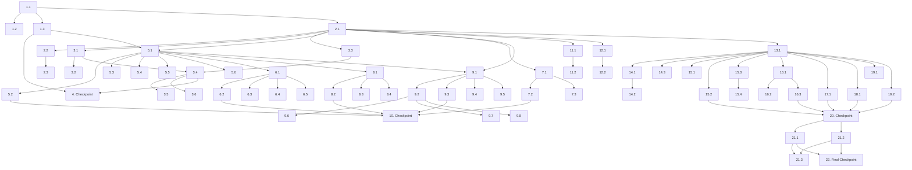

# Implementation Plan: Stock Portfolio Tracker

## Overview

A web application for Thai investors to track US stock/ETF portfolios with interactive charts, OCR-based slip parsing from Dime app, portfolio dashboard with USD/THB display, dividend tracking, watchlist, and data import/export. Built with Next.js 14 + Express.js + PostgreSQL + Redis, containerized with Docker.

## Tasks

- [x] 1. Project setup and infrastructure
  - [x] 1.1 Initialize monorepo structure with backend (Node.js + Express + TypeScript) and frontend (Next.js 14 App Router + TypeScript + Tailwind CSS)
    - Create `backend/` with Express.js, TypeScript config, ESLint, Jest + fast-check setup
    - Create `frontend/` with Next.js 14 App Router, TypeScript, Tailwind CSS, Vitest + React Testing Library + fast-check setup
    - Install shared dependencies: Redux Toolkit (frontend), TradingView Lightweight Charts (frontend), Supertest (backend)
    - _Requirements: 1.1–1.6, 7.1–7.5_

  - [x] 1.2 Create Docker Compose configuration for local development
    - Define services: `frontend`, `backend`, `postgres`, `redis`
    - Configure PostgreSQL with initialization scripts, Redis with persistence
    - Set up environment variables for Google Cloud Vision API key, Financial API key, Exchange Rate API key
    - _Requirements: 7.2, 7.5_

  - [x] 1.3 Create database migration scripts for PostgreSQL schema
    - Create tables: `users`, `tickers`, `transactions`, `dividends`, `watchlist_items`, `exchange_rate_cache`, `price_cache`
    - Define indexes on `transactions(user_id, ticker_symbol, transaction_date)`, `dividends(user_id, ticker_symbol)`, `watchlist_items(user_id)`
    - Add seed data for common US stock/ETF tickers
    - _Requirements: 4.1, 6.1, 11.1, 12.1_

- [x] 2. Core data models, types, and shared utilities
  - [x] 2.1 Define shared TypeScript types and interfaces
    - Create all types from design: `Transaction`, `StructuredTransaction`, `BuyPoint`, `OHLCData`, `PortfolioSummary`, `Holding`, `AssetAllocation`, `Dividend`, `WatchlistItem`, `ExchangeRate`, `OCRResult`, `ParseResult`, `ExportFilters`, `ImportParseResult`, `DuplicateCheckResult`, `TransactionFilters`, `DividendFilters`
    - Define enums: `TimeRange`, `TransactionSource`, `ExportFormat`
    - Define API error response interface `APIError`
    - _Requirements: 4.4, 5.1, 8.2_

  - [x] 2.2 Implement StructuredTransaction serializer/deserializer
    - Implement `serializeTransaction(txn: StructuredTransaction): string`
    - Implement `deserializeTransaction(json: string): StructuredTransaction`
    - Ensure numeric precision is preserved during round-trip
    - _Requirements: 4.5_

  - [x] 2.3 Write property test for StructuredTransaction JSON round-trip
    - **Property 1: StructuredTransaction JSON Round-trip**
    - Generate arbitrary StructuredTransaction objects with valid ticker, ISO date, positive price (2 decimal), positive shares (6 decimal), positive total_amount
    - Assert: `deserializeTransaction(serializeTransaction(txn))` deep-equals original
    - **Validates: Requirements 4.5**

- [x] 3. Backend services — Slip Parser and OCR
  - [x] 3.1 Implement Slip Parser service
    - Implement `parse(ocrText: string): ParseResult` — extract ticker, date, price, shares, total_amount from Dime slip OCR text using regex patterns
    - Implement `toStructuredTransaction(parseResult: ParseResult): StructuredTransaction`
    - Handle multiple date formats, convert to ISO 8601
    - Identify and report missing fields in `missingFields` array
    - _Requirements: 3.3, 3.7, 4.1, 4.2, 4.3, 4.4_

  - [x] 3.2 Write property test for Slip Parser extraction
    - **Property 2: Slip Parser extracts data from OCR text correctly**
    - Generate synthetic OCR text strings containing known ticker, date, price, shares values
    - Assert: parsed ticker matches embedded ticker, date is valid ISO 8601, price has 2 decimal places, shares has 6 decimal places, missing fields are correctly identified
    - **Validates: Requirements 3.3, 3.7, 4.1, 4.2, 4.3, 4.4**

  - [x] 3.3 Implement OCR Service integration with Google Cloud Vision API
    - Implement `extractText(imageBuffer: Buffer): Promise<OCRResult>`
    - Handle API errors with retry logic (2 retries, exponential backoff starting at 2s)
    - Return confidence score and extracted text
    - _Requirements: 3.2, 3.6_

  - [x] 3.4 Implement slip upload API endpoints
    - `POST /api/slips/upload` — single slip upload, validate file type (JPG/PNG) and size (≤10MB), process through OCR + Slip Parser
    - `POST /api/slips/upload-batch` — multi-slip upload (up to 20 files), parallel processing with isolated error handling
    - Return structured transaction data or partial results with missing fields highlighted
    - _Requirements: 3.1, 3.2, 3.4, 3.5, 3.8, 9.1, 9.2, 9.3, 9.5_

  - [x] 3.5 Write property test for batch processing partial failure tolerance
    - **Property 12: Batch Processing tolerates partial failures**
    - Generate arrays of slip processing results (mix of success/failure)
    - Assert: count(successful) + count(failed) === count(total), successful slips are unaffected by failures
    - **Validates: Requirements 9.5**

  - [x] 3.6 Write property test for selective batch save
    - **Property 13: Only selected items from batch are saved**
    - Generate batch results and a random subset selection
    - Assert: saved count === selected count, all saved items are in the selected subset
    - **Validates: Requirements 9.6**

- [x] 4. Checkpoint — Ensure all tests pass
  - Ensure all tests pass, ask the user if questions arise.

- [x] 5. Backend services — Transaction management
  - [x] 5.1 Implement Transaction Service with repository pattern
    - Implement CRUD: `createTransaction`, `updateTransaction`, `deleteTransaction`, `getTransactions`
    - Implement `getBuyPointsForTicker(ticker)` — aggregate transactions by date, return BuyPoint array with transactionCount
    - Implement input validation: reject invalid ticker, future dates, negative/zero price or shares
    - Implement pagination, filtering (ticker, date range), and sorting (date, ticker, amount, asc/desc)
    - _Requirements: 6.1, 6.2, 6.3, 6.4, 6.5, 6.6_

  - [x] 5.2 Implement Transaction API endpoints
    - `GET /api/transactions` with query params for filtering, sorting, pagination
    - `POST /api/transactions`, `PUT /api/transactions/:id`, `DELETE /api/transactions/:id`
    - `GET /api/tickers/validate/:ticker` — validate ticker against database
    - _Requirements: 6.1, 6.2, 6.3, 6.4, 6.5, 6.6_

  - [x] 5.3 Write property test for transaction validation
    - **Property 7: Transaction data validation**
    - Generate invalid transactions (bad ticker, future date, negative price, zero shares) and valid transactions
    - Assert: invalid inputs are rejected, valid inputs are accepted
    - **Validates: Requirements 6.2**

  - [x] 5.4 Write property test for Buy Point aggregation
    - **Property 4: Buy Point Markers aggregate by date**
    - Generate transaction sets with some sharing the same date
    - Assert: marker count === unique date count, each marker's transactionCount matches actual count for that date
    - **Validates: Requirements 2.5**

  - [x] 5.5 Write property test for data filtering
    - **Property 8: Filtering returns only matching records**
    - Generate transaction/dividend sets and random filter criteria (ticker, date range)
    - Assert: all results match all filter criteria, no non-matching records in results
    - **Validates: Requirements 6.5, 8.3, 8.4, 11.4**

  - [x] 5.6 Write property test for data sorting
    - **Property 9: Sorting produces correct order**
    - Generate data sets and random sort criteria (field + direction)
    - Assert: for every adjacent pair, ordering constraint holds
    - **Validates: Requirements 6.6, 12.6**

- [x] 6. Backend services — Portfolio calculations
  - [x] 6.1 Implement Portfolio Service
    - Implement `calculateAverageCostBasis(transactions: Transaction[]): number` — sum(total_amount) / sum(shares)
    - Implement `calculateUnrealizedPL(holdings, currentPrices)` — (currentPrice - avgCost) × shares per holding
    - Implement `getSummary()` — total value USD/THB, unrealized P/L, total return, dividend yield
    - Implement `getAllocation()` — percentage per holding, must sum to 100%
    - Implement `getPerformance(range, benchmark)` — portfolio vs S&P 500 comparison
    - _Requirements: 5.1, 5.2, 5.3, 5.4, 5.5, 5.6_

  - [x] 6.2 Implement Portfolio API endpoints
    - `GET /api/portfolio/summary`, `GET /api/portfolio/allocation`, `GET /api/portfolio/performance`
    - Integrate Redis caching (1-min TTL for summary, invalidate on new transaction)
    - _Requirements: 5.1, 5.4, 5.5, 7.2_

  - [x] 6.3 Write property test for Average Cost Basis calculation
    - **Property 3: Average Cost Basis = sum(total_amount) / sum(shares)**
    - Generate arrays of transactions with positive amounts and shares
    - Assert: result equals sum(total_amount) / sum(shares) within floating-point tolerance
    - **Validates: Requirements 2.4, 5.2**

  - [x] 6.4 Write property test for portfolio value and Unrealized P/L
    - **Property 5: Portfolio value and Unrealized P/L calculations**
    - Generate holdings with cost basis and current prices
    - Assert: totalValue = sum(shares × currentPrice), unrealizedPL per holding = (currentPrice - avgCost) × shares, total unrealizedPL = sum of individual, percent = (totalPL / totalCost) × 100
    - **Validates: Requirements 5.1, 5.3**

  - [x] 6.5 Write property test for Asset Allocation sum to 100%
    - **Property 6: Asset allocation percentages sum to 100%**
    - Generate holdings with positive values
    - Assert: sum of allocation percentages equals 100% (±0.01% tolerance)
    - **Validates: Requirements 5.4**

- [x] 7. Backend services — Exchange Rate and Currency
  - [x] 7.1 Implement Exchange Rate Service
    - Implement `getCurrentRate(): Promise<ExchangeRate>` — fetch USD/THB rate from external API
    - Implement `convertUSDToTHB(amountUSD: number): Promise<number>`
    - Redis caching with 30-min TTL, fallback to PostgreSQL cached rate if API fails
    - Mark stale rates with `isStale: true`
    - _Requirements: 10.1, 10.2, 10.3, 10.4, 10.5, 10.6_

  - [x] 7.2 Implement Exchange Rate API endpoint
    - `GET /api/exchange-rate/usd-thb`
    - _Requirements: 10.1, 10.5_

  - [x] 7.3 Write property test for USD to THB conversion
    - **Property 14: USD to THB conversion = USD × rate**
    - Generate positive USD amounts and positive exchange rates
    - Assert: result equals USD × rate within ±0.01 tolerance
    - **Validates: Requirements 10.1, 10.3**

- [x] 8. Backend services — Dividend tracking
  - [x] 8.1 Implement Dividend Service
    - Implement CRUD: `createDividend`, `updateDividend`, `deleteDividend`, `getDividends`
    - Implement `getDividendSummary(range)` — cumulative dividends in time range
    - Implement `calculateDividendYield(holdings, dividends)` — (annual dividends / portfolio value) × 100
    - Validate that ticker is held by user on dividend date before saving
    - Implement filtering (ticker, date range) and pagination
    - _Requirements: 11.1, 11.2, 11.3, 11.4, 11.5, 11.6_

  - [x] 8.2 Implement Dividend API endpoints
    - `GET /api/dividends`, `POST /api/dividends`, `PUT /api/dividends/:id`, `DELETE /api/dividends/:id`
    - `GET /api/dividends/summary?range={timeRange}`
    - _Requirements: 11.1, 11.4, 11.6_

  - [x] 8.3 Write property test for dividend holding validation
    - **Property 15: Dividend rejected if ticker not held on date**
    - Generate dividend entries with tickers that are/aren't in the user's holdings at the specified date
    - Assert: dividends for non-held tickers are rejected, dividends for held tickers are accepted
    - **Validates: Requirements 11.2**

  - [x] 8.4 Write property test for Total Return and Dividend Yield
    - **Property 16: Total Return and Dividend Yield calculations**
    - Generate holdings with capital gains and dividend history
    - Assert: totalReturn = capitalGain + totalDividends, dividendYield = (annualDividends / portfolioValue) × 100, cumulative dividends in range = sum of dividends with date in range
    - **Validates: Requirements 11.3, 11.5, 11.6**

- [x] 9. Backend services — Export and Import
  - [x] 9.1 Implement Export Service
    - Implement `exportToCSV(filters: ExportFilters): Promise<Buffer>` — generate CSV with all required fields
    - Implement `exportToExcel(filters: ExportFilters): Promise<Buffer>` — generate .xlsx file
    - Implement `importFromCSV(csvBuffer: Buffer): Promise<Transaction[]>` — parse CSV back to transactions
    - Support filtering by ticker and date range, handle empty results
    - _Requirements: 8.1, 8.2, 8.3, 8.4, 8.5, 8.6_

  - [x] 9.2 Implement Dime Import Service
    - Implement `parseFile(fileBuffer, format)` — parse CSV/JSON from Dime app
    - Implement `detectDuplicates(transactions)` — match on ticker + date + price + shares
    - Implement `importTransactions(transactions, overwriteDuplicates)` — save with duplicate handling
    - _Requirements: 13.1, 13.2, 13.3, 13.4, 13.5, 13.6_

  - [x] 9.3 Implement Export and Import API endpoints
    - `GET /api/export/transactions?format={csv|xlsx}&ticker={ticker}&from={date}&to={date}`
    - `POST /api/import/dime` — file upload for CSV/JSON
    - _Requirements: 8.1, 13.1_

  - [x] 9.4 Write property test for CSV Export/Import round-trip
    - **Property 10: CSV Export/Import Round-trip**
    - Generate valid transaction sets, export to CSV, import back
    - Assert: imported transactions deep-equal originals (ticker, date, price, shares, total_amount)
    - **Validates: Requirements 8.6**

  - [x] 9.5 Write property test for export completeness
    - **Property 11: Exported data has all required fields**
    - Generate transaction sets, export to CSV
    - Assert: every row contains ticker, date, price_per_share, shares, total_amount
    - **Validates: Requirements 8.2**

  - [x] 9.6 Write property test for Dime file parsing
    - **Property 17: Dime file parsing extracts all transactions**
    - Generate valid Dime CSV/JSON content with known row count
    - Assert: parsed transaction count === row count, each transaction has all required fields
    - **Validates: Requirements 13.2**

  - [x] 9.7 Write property test for duplicate detection
    - **Property 18: Duplicate detection is accurate**
    - Generate imported transactions and existing transactions with some overlaps
    - Assert: duplicates + unique === total imported, duplicates match on ticker + date + price + shares
    - **Validates: Requirements 13.6**

  - [x] 9.8 Write property test for Dime Import/Export round-trip
    - **Property 19: Dime Import/Export Round-trip**
    - Generate transactions, import from Dime format, export via Data_Exporter, import back
    - Assert: final data deep-equals original
    - **Validates: Requirements 13.7**

- [x] 10. Checkpoint — Ensure all backend tests pass
  - Ensure all tests pass, ask the user if questions arise.

- [x] 11. Backend services — Chart and Stock data
  - [x] 11.1 Implement Chart Service
    - Implement `getStockPrices(ticker, range)` — fetch OHLC data from Financial API
    - Implement `getStockInfo(ticker)` — fetch stock/ETF metadata
    - Implement `searchTickers(query)` — search with autocomplete results
    - Redis caching: 5-min TTL for latest prices, 24-hour TTL for historical data
    - Retry logic: exponential backoff, max 3 retries starting at 1s
    - _Requirements: 1.1, 1.2, 1.3, 1.4, 1.6, 7.2_

  - [x] 11.2 Implement Chart and Stock API endpoints
    - `GET /api/stocks/:ticker/prices?range={timeRange}`
    - `GET /api/stocks/:ticker/info`
    - `GET /api/stocks/search?q={query}`
    - _Requirements: 1.1, 1.5_

- [x] 12. Backend services — Watchlist
  - [x] 12.1 Implement Watchlist Service
    - Implement `getWatchlist()` — return items with current price, daily change, sparkline data
    - Implement `addToWatchlist(ticker)` — validate ticker via Financial API, reject duplicates
    - Implement `removeFromWatchlist(ticker)`
    - Support sorting by ticker, price, or percent change
    - _Requirements: 12.1, 12.2, 12.3, 12.5, 12.6, 12.7_

  - [x] 12.2 Implement Watchlist API endpoints
    - `GET /api/watchlist`, `POST /api/watchlist`, `DELETE /api/watchlist/:ticker`
    - _Requirements: 12.1, 12.5_

- [x] 13. Frontend — Redux store and API client setup
  - [x] 13.1 Set up Redux Toolkit store with slices
    - Create slices: `chartSlice`, `transactionsSlice`, `portfolioSlice`, `dividendsSlice`, `watchlistSlice`, `exchangeRateSlice`, `uiSlice`
    - Define async thunks for all API calls
    - Set up RTK Query or custom API client with base URL configuration
    - _Requirements: 1.1–1.6, 5.1–5.6_

- [x] 14. Frontend — Chart page and components
  - [x] 14.1 Implement StockChart component with TradingView Lightweight Charts
    - Render candlestick chart with OHLC data
    - Display Buy Point Markers at correct date/price positions
    - Draw Average Cost Basis horizontal line
    - Support zoom/pan interactions
    - _Requirements: 1.1, 1.2, 1.5, 2.1, 2.4_

  - [x] 14.2 Implement BuyPointMarker tooltip and click behavior
    - Show tooltip on hover: date, shares, price per share, total amount
    - Show full transaction details in side panel on click
    - Aggregate multiple transactions on same date into single marker with transaction count
    - _Requirements: 2.1, 2.2, 2.3, 2.5_

  - [x] 14.3 Implement TickerSearch with autocomplete and TimeRangeSelector
    - TickerSearch: debounced search input, dropdown with results from `/api/stocks/search`
    - TimeRangeSelector: buttons for 1W, 1M, 3M, 6M, 1Y, All
    - Error state: show banner with retry button when Financial API fails
    - _Requirements: 1.1, 1.3, 1.6_

- [x] 15. Frontend — Transaction management pages
  - [x] 15.1 Implement TransactionForm for manual entry
    - Form fields: Ticker Symbol (with validation), date (no future dates), price per share, shares, total amount
    - Client-side validation matching backend rules
    - _Requirements: 6.1, 6.2_

  - [x] 15.2 Implement TransactionTable with filtering and sorting
    - Display all transactions in paginated table
    - Filter by ticker symbol and date range
    - Sort by date, ticker, or amount (asc/desc)
    - Edit and delete actions with confirmation dialog for delete
    - _Requirements: 6.3, 6.4, 6.5, 6.6_

  - [x] 15.3 Implement SlipUploader component
    - Drag & drop and file picker for JPG/PNG images (≤10MB)
    - Single and multi-file upload (up to 20 files)
    - Progress bar for batch upload showing processed/total count
    - _Requirements: 3.1, 3.8, 9.1, 9.4_

  - [x] 15.4 Implement ConfirmationModal for OCR results
    - Display parsed transaction data with editable fields
    - Highlight missing fields that need manual input
    - For batch: show summary of successful/failed parses, allow selective confirmation
    - Offer manual entry fallback when OCR fails completely
    - _Requirements: 3.4, 3.5, 3.6, 3.7, 9.3, 9.6_

- [x] 16. Frontend — Portfolio Dashboard
  - [x] 16.1 Implement PortfolioDashboard page
    - Display total portfolio value (USD/THB), unrealized P/L (amount + percent), total return
    - Display average cost basis per holding
    - Display dividend yield percentage
    - Show exchange rate with last-updated timestamp, stale indicator
    - _Requirements: 5.1, 5.2, 5.3, 5.5, 10.1, 10.3, 10.5, 11.5_

  - [x] 16.2 Implement CurrencyToggle and Asset Allocation chart
    - CurrencyToggle: switch between USD and THB display
    - Asset Allocation: pie chart using Recharts showing percentage per holding
    - _Requirements: 5.4, 10.1, 10.4_

  - [x] 16.3 Implement BenchmarkComparison chart
    - Line chart comparing portfolio performance vs S&P 500 over selected time range
    - Time range selector integration
    - _Requirements: 5.5_

- [x] 17. Frontend â€" Dividend tracking pages
  - [x] 17.1 Implement DividendForm and DividendTable
    - DividendForm: ticker (validated against holdings), date, amount per share, total amount
    - DividendTable: paginated table with filtering by ticker and date range
    - Edit and delete actions
    - Display cumulative dividend summary for selected time range
    - _Requirements: 11.1, 11.2, 11.4, 11.6_

- [x] 18. Frontend — Watchlist
  - [x] 18.1 Implement WatchlistPanel and WatchlistItem components
    - Display list with current price, daily change (amount + percent), sparkline (7-day close prices)
    - Add ticker with validation, reject duplicates with message
    - Remove ticker from watchlist
    - Sort by ticker, price, or percent change
    - Click item to navigate to full chart view
    - _Requirements: 12.1, 12.2, 12.3, 12.4, 12.5, 12.6, 12.7_

- [x] 19. Frontend — Export and Import dialogs
  - [x] 19.1 Implement ExportDialog component
    - Format selection: CSV or Excel
    - Optional filters: ticker symbol, date range
    - Handle empty results with user notification
    - Trigger file download
    - _Requirements: 8.1, 8.2, 8.3, 8.4, 8.5_

  - [x] 19.2 Implement DimeImportDialog component
    - File upload for CSV/JSON from Dime
    - Show preview of parsed transactions in confirmation modal
    - Display duplicate detection results, allow skip or overwrite
    - Handle invalid file format with error message
    - _Requirements: 13.1, 13.2, 13.3, 13.4, 13.5, 13.6_

- [x] 20. Checkpoint — Ensure all frontend and backend tests pass
  - Ensure all tests pass, ask the user if questions arise.

- [x] 21. Integration wiring and error handling
  - [x] 21.1 Wire frontend pages with backend API endpoints
    - Connect all Redux async thunks to actual API endpoints
    - Implement global error handling: toast notifications for network errors, retry buttons
    - Implement loading states and skeleton screens
    - Handle Exchange Rate API failure: show cached rate with stale indicator
    - Handle Financial API failure: show error banner with retry
    - Handle OCR failure: offer manual entry fallback
    - _Requirements: 1.6, 3.6, 7.1, 7.3, 7.4, 10.6_

  - [x] 21.2 Implement cache invalidation and data refresh logic
    - Invalidate portfolio summary cache when transactions or dividends change
    - Refresh chart and dashboard after transaction CRUD operations
    - Refresh dashboard after dividend CRUD operations
    - _Requirements: 3.5, 5.6, 6.4, 7.2_

  - [x] 21.3 Write integration tests for critical API flows
    - Test: slip upload → OCR → parse → confirm → save → chart refresh
    - Test: manual transaction CRUD → portfolio recalculation
    - Test: Dime import → duplicate detection → selective save
    - Test: export CSV → import CSV round-trip
    - Test: dividend CRUD → total return recalculation
    - _Requirements: 3.2–3.5, 6.1–6.4, 8.6, 11.1–11.3, 13.1–13.6_

- [x] 22. Final checkpoint — Ensure all tests pass
  - Ensure all tests pass, ask the user if questions arise.

## Task Dependency Graph



```json
{
  "waves": [
    ["1.1"],
    ["1.2", "1.3", "2.1"],
    ["2.2", "3.1", "3.3", "5.1", "7.1", "11.1", "12.1", "13.1"],
    ["2.3", "3.2", "3.4", "5.2", "5.3", "5.4", "5.5", "5.6", "6.1", "7.2", "7.3", "9.1", "11.2", "12.2", "14.1", "14.3", "15.1", "15.2", "15.3", "16.1", "17.1", "18.1", "19.1", "19.2"],
    ["3.5", "3.6", "6.2", "6.3", "6.4", "6.5", "8.1", "9.2", "9.3", "9.4", "9.5", "14.2", "15.4", "16.2", "16.3"],
    ["8.2", "8.3", "8.4", "9.6", "9.7", "9.8"],
    ["4", "10", "20"],
    ["21.1", "21.2"],
    ["21.3"],
    ["22"]
  ]
}
```

## Notes

- Tasks marked with `*` are optional and can be skipped for faster MVP
- Each task references specific requirements for traceability
- Checkpoints ensure incremental validation throughout implementation
- Property-based tests (19 total) use fast-check and validate all correctness properties from the design document
- Backend uses Jest + fast-check + Supertest; Frontend uses Vitest + React Testing Library + fast-check
- All monetary calculations should use appropriate precision to avoid floating-point errors
